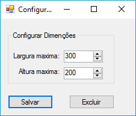
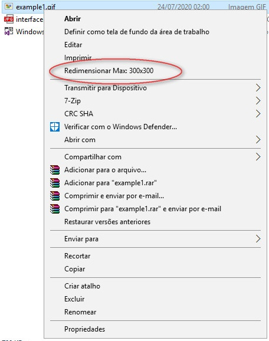
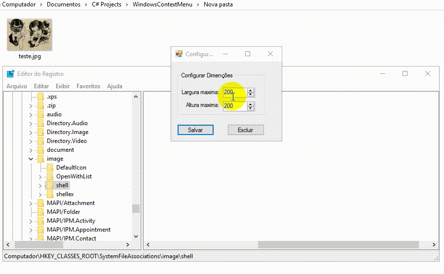

Atalho Redimensionador de imagem
============================
Muito trabalho em reduzir o tamanho de imagens manualmente?
Está aqui a Solução, um pequeno programa que adiciona e configura um item de menu de contexto do botão direito do mouse ao clicar sobre imagens no Windows, 
possibilitando redimensionar uma ou varias imagem com apenas 2 cliques com a definição que desejar, sem necessidade de abrir qualquer programa de edição.
Bem Simples:
1. Abra o Programa no modo Adminitrador.
2. Defina a qualidade que deseja que fique no ContextMenu
3. Salvar!

pronto! Só usar. para excluir a chave, não tem segredo.
 
--------------------------------
### Interface

### ContextMenu
  

### Exemplo
 
